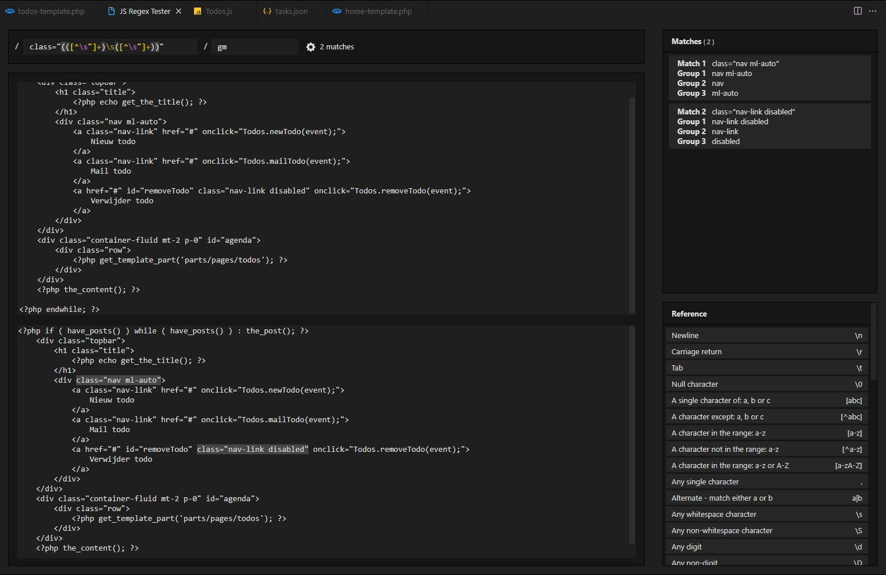
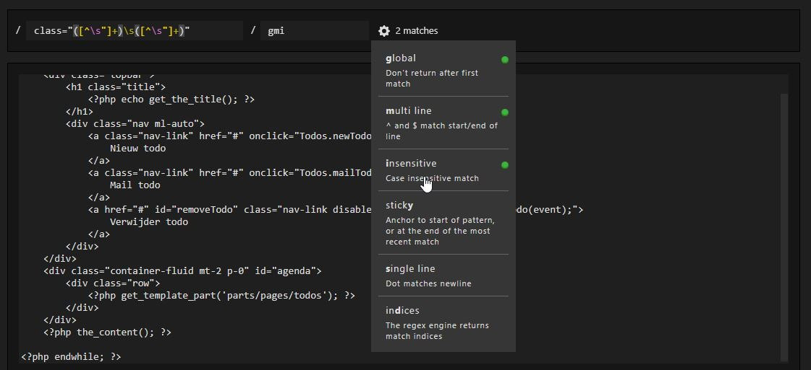
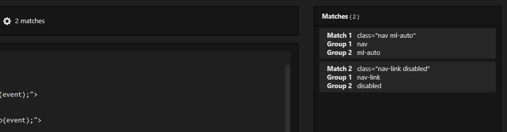
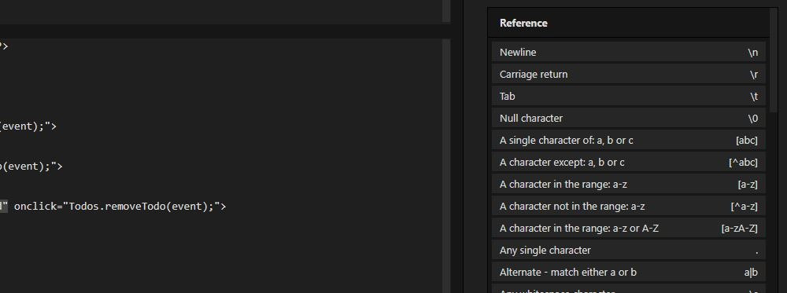
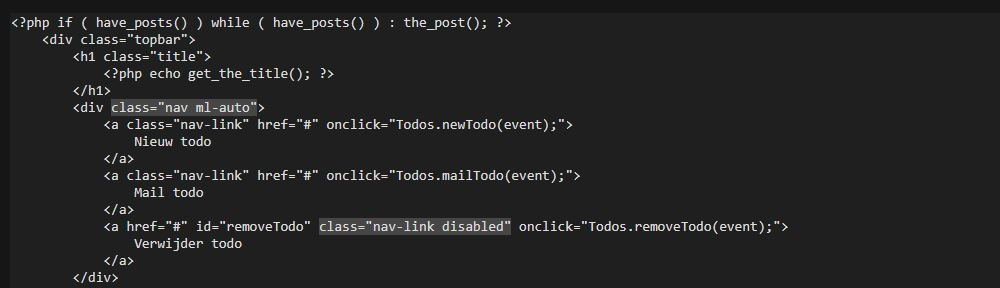
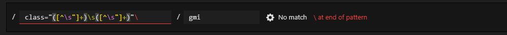

# JS Regex Tester

A complete js regex editor, including regex-highlighting, validation and more.

## Easy modifier modification
You can easily select the modifiers using the dropdown, or you can just type them in.

## Matches overview
A matches overview is shown on the right, it includes match and group information.

## Reference table
Below the matches overview, you can find the Regex reference table.

## Preview area
Matches are highlighted in the preview area.

## Validation
When you make a validation mistake, a error is thrown.

## Commands
- 'Open JS Regex Tester'